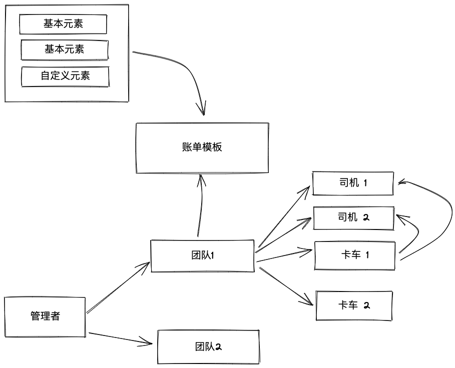
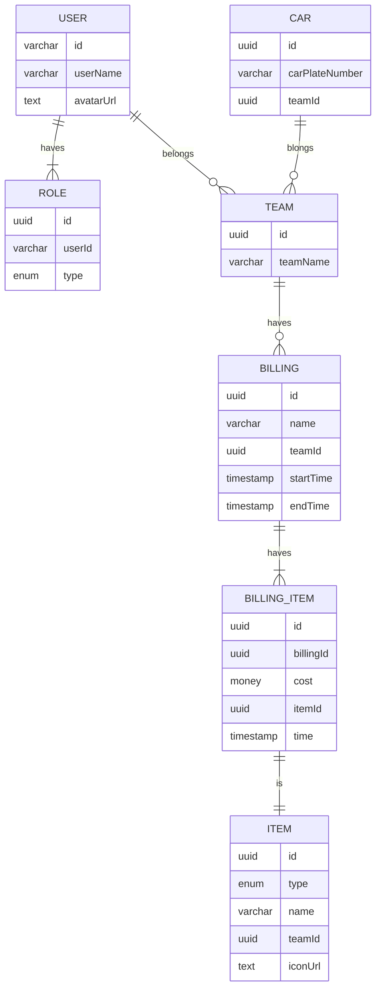

# 卡车账单

此项目为微信小程序的后端, 实现一款快捷记账, 管理卡车团队, 记录花费的一款小程序

## 技术栈选择

1. ORM : Sea-Orm
2. Database: psotreSQL
3. web: poem
4. async: tokio

## 设计理念

1. 用户分为管理者和司机
2. 管理者可以管理多个团队
3. 一个团队中有卡车和司机两种元素
4. 团队可以有自己的账单模板, 账单元素只允许新加不允许删除(待定)
5. 一个账单与一个卡车绑定
6. 卡车出车前, 设置司机和卡车的绑定关系, 绑定关系的司机可以记账
7. 卡车收车后, 一个账单结束, 计入总帐
8. 账单模板可以设定

## ER图

